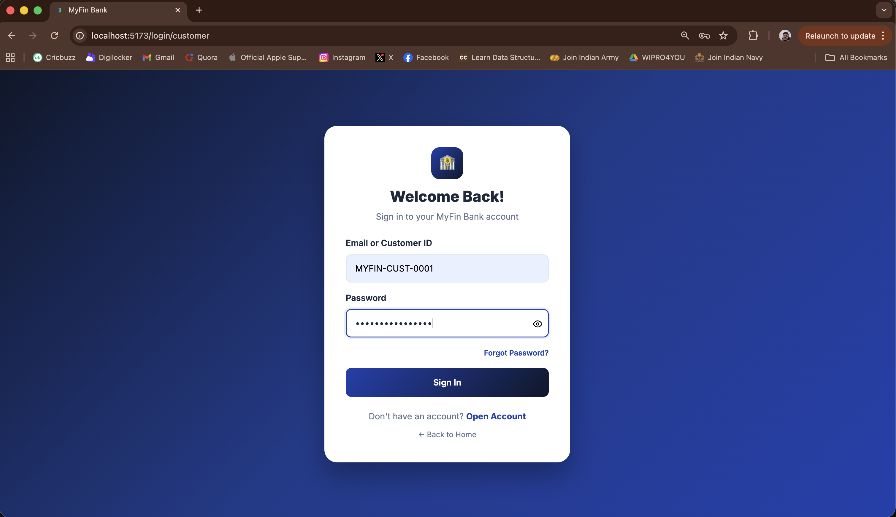
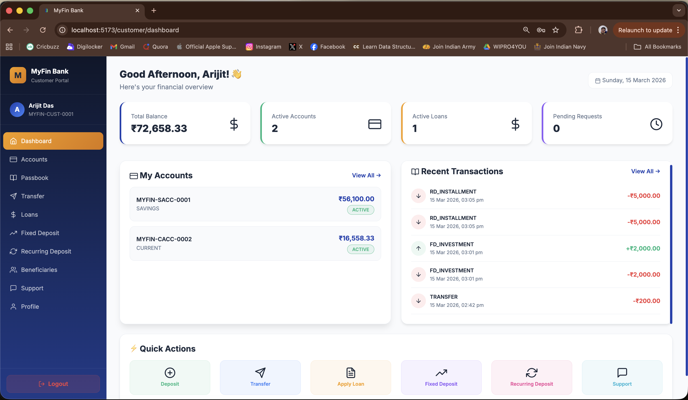
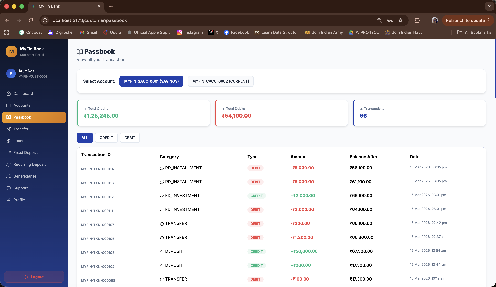
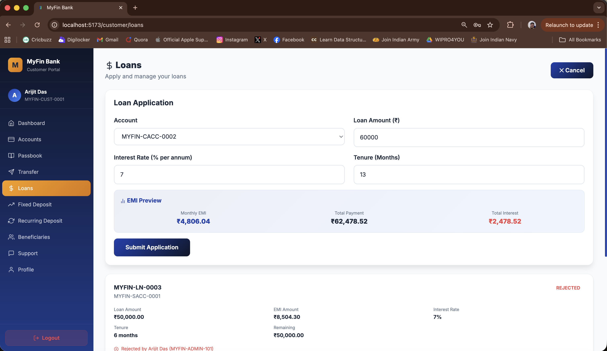
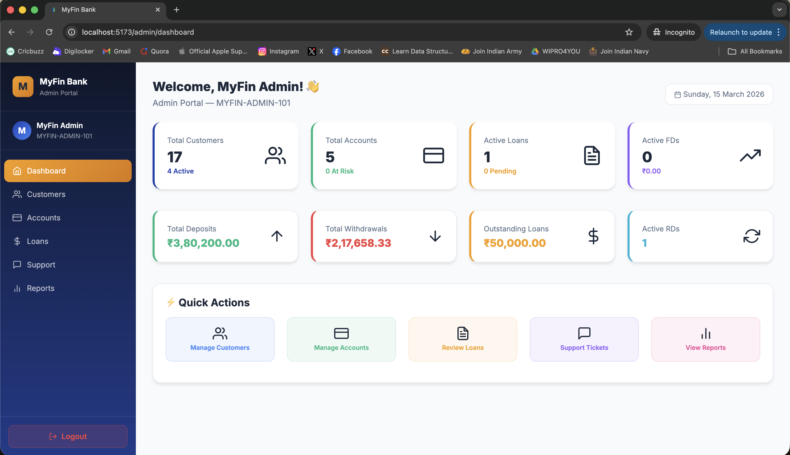
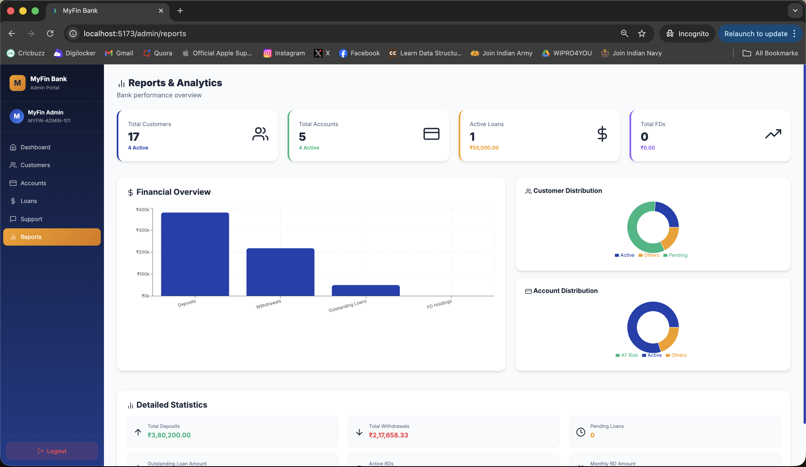

# MyFin Bank

**MyFin Bank** is a full-stack digital banking system built using the **MERN stack**.
It allows customers to perform common banking operations online while providing administrators with full control over customer accounts, loans, and system monitoring.

---

# Table of Contents

* Overview
* Features
* Tech Stack
* System Architecture
* Project Structure
* Screenshots
* Getting Started
* Environment Variables
* Running the Application
* Running Tests
* API Overview
* Demo Credentials

---

# Overview

MyFin Bank simulates a real-world banking environment where customers can manage their accounts, perform transactions, apply for loans, and interact with support.

Administrators can monitor accounts, approve requests, manage users, and generate reports.

The system also includes automated background processes such as EMI deductions and account status updates.

---

# Features

## Customer Features

* Customer registration and login
* Secure account authentication
* Deposit and withdraw funds
* Transfer money between accounts
* Apply for loans
* EMI calculator for loan estimation
* Open Fixed Deposit and Recurring Deposit
* View passbook and transaction history
* Real-time chat with support
* Forgot password with OTP email verification

---

## Admin Features

* Secure admin login
* Role-based access (Admin / Super Admin)
* Manage customer accounts
* Approve or reject loan applications
* Activate or deactivate customers
* Monitor system activity
* Support ticket management
* Analytics and reports dashboard

---

## Automated System Features

* Automatic EMI deduction on the **1st of every month**
* Account auto-deactivation after **24 hours of zero balance**
* Beneficiary auto-approval after **30 minutes**
* KYC document upload and verification
* Email alerts for important banking events

---

# Tech Stack

## Backend

* Node.js
* Express.js
* MongoDB
* Mongoose
* JWT Authentication
* bcryptjs password hashing
* Socket.io for real-time chat
* Nodemailer for email notifications
* Node-cron for scheduled jobs
* Multer for file uploads
* Mocha + Chai + Supertest for testing

---

## Frontend

* React 19
* Vite
* Redux Toolkit
* React Router DOM
* Axios
* Formik + Yup
* Bootstrap + React Bootstrap
* Socket.io Client
* Framer Motion
* Recharts
* React Icons
* Vitest + React Testing Library
* Cypress for E2E testing

---

# System Architecture

The application follows a **client-server architecture**.

```
Frontend (React + Redux)
        │
        │  REST API
        ▼
Backend (Node.js + Express)
        │
        │  Database Queries
        ▼
MongoDB Database
```

Additional services include:

* **Socket.io** for real-time communication
* **Cron jobs** for automated system tasks
* **Email services** for notifications

---

# Project Structure

```
myfin-bank/

backend/
│
├── controllers/
├── services/
├── models/
├── routes/
├── middleware/
├── utils/
├── tests/
├── uploads/
├── connection.js
└── server.js


frontend/
│
├── src/
│   ├── components/
│   ├── pages/
│   ├── features/
│   ├── services/
│   ├── hooks/
│   ├── utils/
│   └── tests/
│
├── cypress/
└── vite.config.js


.env.example
README.md
```

---

# Screenshots

## Screenshots

<p align="center">










</p>

---

# Getting Started

## Prerequisites

Make sure the following are installed:

* Node.js (v18 or higher)
* MongoDB (local or Atlas)
* Gmail account with App Password enabled

---

# Installation

Clone the repository

```
git clone https://github.com/your-username/myfin-bank.git
cd myfin-bank
```

Install backend dependencies

```
npm install
```

Install frontend dependencies

```
cd frontend
npm install
cd ..
```

Create environment file

```
cp .env.example .env
```

Fill in the required environment variables.

---

# Environment Variables

Create `.env` in the root directory.

```
PORT=5001
NODE_ENV=development

MONGO_URI=mongodb://localhost:27017/myfinbank

JWT_SECRET=your_secret_key

EMAIL_USER=your_email@gmail.com
EMAIL_PASS=your_gmail_app_password

ADMIN_EMAIL=admin@email.com
SUPER_ADMIN_EMAIL=superadmin@email.com

CLIENT_URL=http://localhost:5173
```

Frontend environment file

`frontend/.env`

```
VITE_API_URL=http://localhost:5001/api
```

---

# Running the Application

Start backend server

```
npm run dev
```

Start frontend server

```
cd frontend
npm run dev
```

Application URLs:

Backend
`http://localhost:5001`

Frontend
`http://localhost:5173`

---

# Running Tests

Backend tests

```
npm test
```

Frontend tests

```
cd frontend
npm test
```

End-to-end tests

```
cd frontend
npx cypress open
```

---

# API Overview

| Method | Endpoint                                     | Description            |
| ------ | -------------------------------------------- | ---------------------- |
| POST   | /api/auth/customer/register                  | Register customer      |
| POST   | /api/auth/customer/login                     | Customer login         |
| POST   | /api/auth/admin/login                        | Admin login            |
| GET    | /api/accounts/my-accounts                    | Get accounts           |
| POST   | /api/transactions/deposit                    | Deposit money          |
| POST   | /api/transactions/withdraw                   | Withdraw money         |
| POST   | /api/transactions/transfer                   | Transfer funds         |
| GET    | /api/transactions/passbook/:accountNumber    | View passbook          |
| POST   | /api/loans/apply                             | Apply for loan         |
| GET    | /api/loans/my-loans                          | Get loans              |
| PATCH  | /api/loans/:loanId/approve                   | Approve loan           |
| POST   | /api/fd/open                                 | Open fixed deposit     |
| POST   | /api/rd/open                                 | Open recurring deposit |
| POST   | /api/support/tickets/create                  | Create support ticket  |
| POST   | /api/support/tickets/:ticketId/messages/send | Send support message   |
| GET    | /api/admin/customers                         | Get customers          |
| GET    | /api/admin/reports/summary                   | Reports dashboard      |

---

# Demo Credentials

Customer Login

```
Email: customer@test.com
Password: password123
```

Admin Login

```
Email: admin@test.com
Password: admin123
```

---

# License

This project is created for educational purposes and academic submission.
